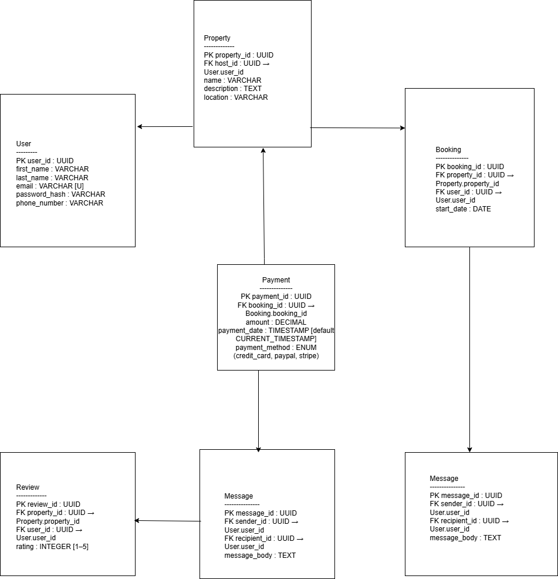

# 📘 Airbnb Database Design – Entity Relationship Documentation

This document provides a detailed breakdown of the entities, attributes, and relationships for the Airbnb-like application database.

---

## 🧱 Entities and Attributes

### 1. **User**
| Attribute        | Type                                  | Constraints                               |
|------------------|----------------------------------------|-------------------------------------------|
| `user_id`        | UUID                                   | Primary Key, Indexed                      |
| `first_name`     | VARCHAR                                | NOT NULL                                  |
| `last_name`      | VARCHAR                                | NOT NULL                                  |
| `email`          | VARCHAR                                | UNIQUE, NOT NULL                          |
| `password_hash`  | VARCHAR                                | NOT NULL                                  |
| `phone_number`   | VARCHAR                                | NULL                                      |
| `role`           | ENUM(`guest`, `host`, `admin`)         | NOT NULL                                  |
| `created_at`     | TIMESTAMP                              | DEFAULT CURRENT_TIMESTAMP                 |

---

### 2. **Property**
| Attribute         | Type         | Constraints                              |
|-------------------|--------------|------------------------------------------|
| `property_id`     | UUID         | Primary Key, Indexed                     |
| `host_id`         | UUID         | Foreign Key → User(`user_id`)            |
| `name`            | VARCHAR      | NOT NULL                                 |
| `description`     | TEXT         | NOT NULL                                 |
| `location`        | VARCHAR      | NOT NULL                                 |
| `pricepernight`   | DECIMAL      | NOT NULL                                 |
| `created_at`      | TIMESTAMP    | DEFAULT CURRENT_TIMESTAMP                |
| `updated_at`      | TIMESTAMP    | ON UPDATE CURRENT_TIMESTAMP              |

---

### 3. **Booking**
| Attribute         | Type         | Constraints                              |
|-------------------|--------------|------------------------------------------|
| `booking_id`      | UUID         | Primary Key, Indexed                     |
| `property_id`     | UUID         | Foreign Key → Property(`property_id`)    |
| `user_id`         | UUID         | Foreign Key → User(`user_id`)            |
| `start_date`      | DATE         | NOT NULL                                 |
| `end_date`        | DATE         | NOT NULL                                 |
| `total_price`     | DECIMAL      | NOT NULL                                 |
| `status`          | ENUM(`pending`, `confirmed`, `canceled`) | NOT NULL |
| `created_at`      | TIMESTAMP    | DEFAULT CURRENT_TIMESTAMP                |

---

### 4. **Payment**
| Attribute         | Type         | Constraints                              |
|-------------------|--------------|------------------------------------------|
| `payment_id`      | UUID         | Primary Key, Indexed                     |
| `booking_id`      | UUID         | Foreign Key → Booking(`booking_id`)      |
| `amount`          | DECIMAL      | NOT NULL                                 |
| `payment_date`    | TIMESTAMP    | DEFAULT CURRENT_TIMESTAMP                |
| `payment_method`  | ENUM(`credit_card`, `paypal`, `stripe`) | NOT NULL |

---

### 5. **Review**
| Attribute         | Type         | Constraints                              |
|-------------------|--------------|------------------------------------------|
| `review_id`       | UUID         | Primary Key, Indexed                     |
| `property_id`     | UUID         | Foreign Key → Property(`property_id`)    |
| `user_id`         | UUID         | Foreign Key → User(`user_id`)            |
| `rating`          | INTEGER      | CHECK BETWEEN 1 AND 5, NOT NULL          |
| `comment`         | TEXT         | NOT NULL                                 |
| `created_at`      | TIMESTAMP    | DEFAULT CURRENT_TIMESTAMP                |

---

### 6. **Message**
| Attribute         | Type         | Constraints                              |
|-------------------|--------------|------------------------------------------|
| `message_id`      | UUID         | Primary Key, Indexed                     |
| `sender_id`       | UUID         | Foreign Key → User(`user_id`)            |
| `recipient_id`    | UUID         | Foreign Key → User(`user_id`)            |
| `message_body`    | TEXT         | NOT NULL                                 |
| `sent_at`         | TIMESTAMP    | DEFAULT CURRENT_TIMESTAMP                |

---

## 🔗 Entity Relationships

| Relationship                        | Type           | Description |
|-------------------------------------|----------------|-------------|
| **User → Property**                | One-to-Many    | A host owns multiple properties |
| **User → Booking**                 | One-to-Many    | A guest can make multiple bookings |
| **Property → Booking**             | One-to-Many    | A property can be booked many times |
| **Booking → Payment**              | One-to-One     | Each booking has one payment |
| **User → Review**                  | One-to-Many    | A guest can leave multiple reviews |
| **Property → Review**              | One-to-Many    | A property can have many reviews |
| **User (Sender) → Message**        | One-to-Many    | A user can send many messages |
| **User (Recipient) → Message**     | One-to-Many    | A user can receive many messages |
| **User ↔ User (via Message)**      | Many-to-Many   | Users can communicate with each other |

---

## 📌 Indexing & Constraints Summary

- **Primary Keys**: Auto-indexed
- **Unique**: `email` in the `User` table
- **Foreign Keys**:
  - `host_id` → `User.user_id`
  - `property_id` in `Booking` and `Review`
  - `user_id` in `Booking`, `Review`, and `Message`
  - `booking_id` in `Payment`
- **Constraints**:
  - Rating must be between 1 and 5
  - Enum restrictions on `role`, `status`, and `payment_method`

---

#  ALX Airbnb Database Summary – ERD

##  Objective
This file contains the Entity-Relationship Diagram (ERD) based on the Airbnb database specification.

---

## 🔎 Entities Identified

1. **User**
2. **Property**
3. **Booking**
4. **Payment**
5. **Review**
6. **Message**

---

## 🔁 Relationships

- One User can host many Properties
- One User can make many Bookings
- One Booking has one Payment
- One User can write many Reviews for Properties
- Users can send many Messages to other Users

---

## 🖼️ ER Diagram

> 

*Alternative: Link to hosted image*  
> [View ER Diagram](https://drive.google.com/file/d/1flkCrQvauazm76ckz-KNkvbykhoOJ06v/view?usp=sharing)

---

## 📌 Notes

- All primary keys are UUIDs and indexed
- Foreign keys and constraints ensure referential integrity
- Enum values are respected for roles, status, and payment methods
